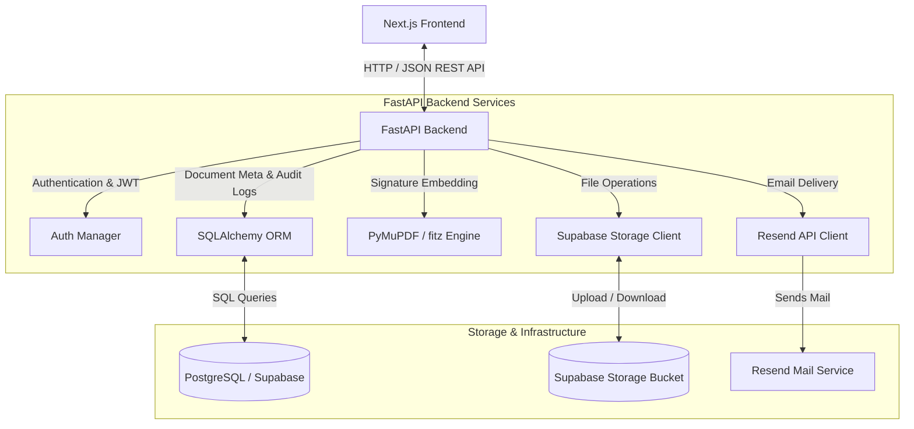

# Document Signature & Automation Platform

A comprehensive, self-hosted platform for uploading, annotating (signing), managing, and securely distributing PDF documents. The application features interactive drag-and-drop signing, secure public link sharing, audit logging, and email delivery.

---

## 🏗️ Architecture Overview

The system is designed with a modern decoupled architecture consisting of a React-based Next.js frontend, an asynchronous Python FastAPI backend, a relational PostgreSQL database, and cloud/local file storage.

### System Architecture Diagram



---

## 📁 Project Structure

```text
signature-app/
├── backend/                       # FastAPI Python Backend
│   ├── models/                    # SQLAlchemy Database Models
│   ├── routers/                   # API Routes (Auth, Documents, Signatures, Audit)
│   ├── schemas/                   # Pydantic Schemas for validation
│   ├── services/                  # Business Logic (Database, PDF, Storage, Email)
│   ├── utils/                     # Utility helpers (PDF loading, helpers)
│   ├── uploads/                   # Local uploads cache (if configured)
│   ├── main.py                    # App entry point & CORS configuration
│   └── requirements.txt           # Python backend dependencies
│
└── frontend/
    └── signature-app-frontend/    # Next.js TypeScript Frontend
        ├── app/                   # App Router Pages & Components
        │   ├── (auth)/            # Auth routes (Login / Signup)
        │   ├── dashboard/         # User Dashboard and Management console
        │   └── sign/              # Signer interfaces & public requests
        ├── lib/                   # API clients and utilities
        ├── public/                # Static assets (logos, PDF worker)
        └── package.json           # Node.js frontend dependencies
```

---

## 🛡️ Database & Models Schema

The application uses SQLAlchemy to model its relational data:

*   **`User`**: Manages credentials and accounts (ID, Email, Hashed Password).
*   **`Document`**: Records metadata of uploaded files (ID, Title, Filename, Supabase File URL, Owner ID, Status, Timestamps).
*   **`Signature`**: Tracks the signature positions and style applied to a document (ID, Document ID, Signer Email, Coordinates [X, Y], Canvas Width & Height, Signature Type [Text/Draw/Image], Font Style, Color, Page Number, Timestamps).
*   **`SigningLink`**: Handles secure public URLs generated for sharing document access (ID, Document ID, Unique Token, Expiration date, Usage status).
*   **`AuditLog`**: Logs all administrative and signature operations for compliance and integrity (ID, Action Name, Document ID, User ID, Client IP Address, Details, Timestamp).

---

## 🚀 Running the Application Locally

Follow the steps below to configure and run the backend and frontend services.

### Prerequisites
Make sure you have the following installed:
*   [Python 3.10+](https://www.python.org/downloads/)
*   [Node.js 18+](https://nodejs.org/) (with npm)
*   A [Supabase](https://supabase.com/) account (for PostgreSQL database and Storage buckets)

---

### 1. Backend Setup (FastAPI)

1.  **Navigate to the backend directory:**
    ```bash
    cd backend
    ```

2.  **Create and activate a virtual environment:**
    *   **Windows (PowerShell):**
        ```powershell
        python -m venv venv
        .\venv\Scripts\Activate.ps1
        ```
    *   **macOS / Linux:**
        ```bash
        python3 -m venv venv
        source venv/bin/activate
        ```

3.  **Install the required dependencies:**
    ```bash
    pip install -r requirements.txt
    ```

4.  **Create a `.env` file:**
    Duplicate or create a `.env` file in the `backend` folder containing the following configuration:
    ```env
    # Database Connection
    DATABASE_URL=sqlite:///./docsign.db  # Use sqlite for local quick tests, or replace with PostgreSQL link

    # Security
    SECRET_KEY=generate_a_secure_random_hex_string_here
    ALGORITHM=HS256
    ACCESS_TOKEN_EXPIRE_MINUTES=60

    # Cross-Origin Resource Sharing
    FRONTEND_URL=http://localhost:3000

    # Email Notifications (via Resend)
    RESEND_API_KEY=your_resend_api_key_here

    # File Storage (via Supabase)
    SUPABASE_URL=https://your-project-id.supabase.co
    SUPABASE_SERVICE_KEY=your-supabase-service-role-key-here
    ```

    > [!IMPORTANT]
    > If using Supabase Storage, ensure you have created a public bucket named `documents` in your Supabase project dashboard.

5.  **Start the FastAPI server:**
    ```bash
    uvicorn main:app --reload
    ```
    The API documentation will be available at `http://127.0.0.1:8000/docs` (Swagger UI) or `http://127.0.0.1:8000/redoc`.

---

### 2. Frontend Setup (Next.js)

1.  **Navigate to the frontend directory:**
    ```bash
    cd frontend/signature-app-frontend
    ```

2.  **Install dependencies:**
    ```bash
    npm install
    ```

3.  **Create a `.env.local` file:**
    Add a `.env.local` file in the root of `signature-app-frontend` pointing to the backend API:
    ```env
    NEXT_PUBLIC_API_URL=http://127.0.0.1:8000
    ```

4.  **Run the Next.js development server:**
    ```bash
    npm run dev
    ```
    Open `http://localhost:3000` in your browser to view the application.

---

## ⚡ Deployment & Production Considerations

*   **Database**: For production deployment, use a managed database instance (such as Supabase PostgreSQL or AWS RDS) instead of SQLite. Update the `DATABASE_URL` connection string accordingly.
*   **Storage Policies**: Secure the Supabase storage bucket with appropriate policies to control access permissions for documents.
*   **Production Build**:
    *   To build the frontend for production, run `npm run build` and then `npm run start`.
    *   For the backend, run `uvicorn main:app --host 0.0.0.0 --port 8000` behind a reverse proxy like Nginx or deployed directly to platforms like Render/Fly.io.